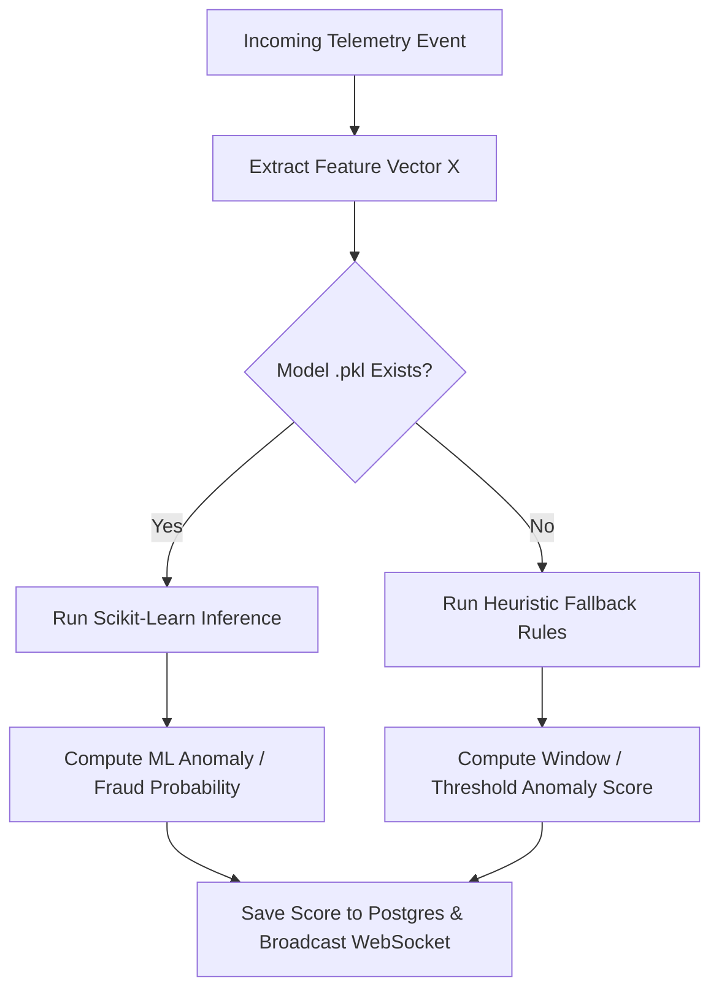

# 🤖 Machine Learning Models Documentation

This document explains **ONLY** the Machine Learning (ML) models, feature engineering, mathematical algorithms, training workflows, and live inference mechanisms used in the platform.

---

## 🎯 Summary of ML Models

The system incorporates two distinct Scikit-Learn Machine Learning models running asynchronously inside dedicated threat micro-consumers:

| Model Name | ML Algorithm | Model Category | Binary Location | Purpose |
| :--- | :--- | :--- | :--- | :--- |
| **Behavioral Anomaly Model** | `IsolationForest` | Unsupervised ML | `models/anomaly/model.pkl` | Detects zero-day threats, abnormal session behavior, & traffic outliers |
| **Checkout Fraud Model** | `LogisticRegression` | Supervised ML | `models/fraud/model.pkl` | Flags fraudulent e-commerce orders, price spikes, & card retry velocity |

---

## 1. 🌲 Model 1: Unsupervised Behavioral Anomaly Model (`IsolationForest`)

* **Algorithm**: `sklearn.ensemble.IsolationForest`
* **Artifact Path**: [`cyber_dashboard/backend/models/anomaly/model.pkl`](file:///c:/Users/Shivam/OneDrive/Documents/Desktop/cyber_security/cyber_dashboard/backend/models/anomaly/model.pkl)
* **Inference Module**: [`cyber_dashboard/backend/consumers/anomaly/inference/predictor.py`](file:///c:/Users/Shivam/OneDrive/Documents/Desktop/cyber_security/cyber_dashboard/backend/consumers/anomaly/inference/predictor.py)
* **Feature Extractor**: [`cyber_dashboard/backend/consumers/anomaly/preprocessing/features.py`](file:///c:/Users/Shivam/OneDrive/Documents/Desktop/cyber_security/cyber_dashboard/backend/consumers/anomaly/preprocessing/features.py)

### 📊 Feature Vector Specification ($4\text{D}$)
The model evaluates a 4-dimensional continuous feature vector $X$ computed per IP address over rolling 10-event windows:

$$X = [\text{latency\_avg},\; \text{latency\_std},\; \text{error\_rate},\; \text{path\_variety}]$$

| Feature Name | Type | Range | Description |
| :--- | :--- | :--- | :--- |
| `latency_avg` | `float` | $[0.0, \infty)$ | Mean response time (in milliseconds) across the IP's window |
| `latency_std` | `float` | $[0.0, \infty)$ | Standard deviation of response times in the window |
| `error_rate` | `float` | $[0.0, 1.0]$ | Proportion of HTTP $4xx / 5xx$ error responses in the window |
| `path_variety` | `float` | $[0.1, 1.0]$ | Ratio of unique endpoint URIs visited vs total window requests |

---

### 🧮 Mathematical Model & Score Normalization

#### 1. Isolation Path Length
Isolation Forest constructs an ensemble of isolation trees ($iTrees$). The anomaly score $s(x, n)$ for a feature vector $x$ over $n$ samples is defined as:

$$s(x, n) = 2^{-\frac{E(h(x))}{c(n)}}$$

Where:
* $h(x)$ is the path length of sample $x$ in an isolation tree.
* $E(h(x))$ is the average path length across all trees in the forest.
* $c(n) = 2 \ln(n - 1) + 0.5772156649 - \frac{2(n - 1)}{n}$ is the average path length of unsuccessful searches in a Binary Search Tree (BST).

#### 2. Sigmoid Score Normalization
Scikit-Learn returns a decision function score $d(x)$ where negative values ($d(x) < 0$) indicate outliers. We normalize $d(x)$ into a clean $[0.0, 1.0]$ severity probability:

$$\text{Anomaly Score} = \frac{1}{1 + e^{5 \cdot d(x)}}$$

```python
# Inference implementation in predictor.py
decision_score = model.decision_function(X)[0]
anomaly_score = float(1.0 / (1.0 + np.exp(decision_score * 5.0)))
is_anomaly = (model.predict(X)[0] == -1)
```

---

## 2. 🎯 Model 2: Supervised Checkout Fraud Model (`LogisticRegression`)

* **Algorithm**: `sklearn.linear_model.LogisticRegression`
* **Artifact Path**: [`cyber_dashboard/backend/models/fraud/model.pkl`](file:///c:/Users/Shivam/OneDrive/Documents/Desktop/cyber_security/cyber_dashboard/backend/models/fraud/model.pkl)
* **Inference Module**: [`cyber_dashboard/backend/consumers/fraud/inference/predictor.py`](file:///c:/Users/Shivam/OneDrive/Documents/Desktop/cyber_security/cyber_dashboard/backend/consumers/fraud/inference/predictor.py)
* **Feature Extractor**: [`cyber_dashboard/backend/consumers/fraud/preprocessing/features.py`](file:///c:/Users/Shivam/OneDrive/Documents/Desktop/cyber_security/cyber_dashboard/backend/consumers/fraud/preprocessing/features.py)

### 📊 Feature Vector Specification ($4\text{D}$)
The model evaluates a 4-dimensional feature vector $X$ computed per customer checkout attempt:

$$X = [\text{order\_count\_last\_hour},\; \text{current\_order\_price},\; \text{avg\_order\_price},\; \text{payment\_method\_val}]$$

| Feature Name | Type | Range | Description |
| :--- | :--- | :--- | :--- |
| `order_count_last_hour` | `int` | $[0, \infty)$ | Count of orders placed by the user in the past 60 minutes |
| `current_order_price` | `float` | $[0.0, \infty)$ | Total dollar amount ($) of the active checkout transaction |
| `avg_order_price` | `float` | $[0.0, \infty)$ | Customer's historical average order total ($) |
| `payment_method_val` | `int` | $\{0, 1, 2\}$ | Encoded payment index (`0: Card`, `1: UPI`, `2: COD`) |

---

### 🧮 Mathematical Model & Probability Inference

Logistic Regression models the conditional probability of fraud $P(Y = 1 \mid X)$ using the Logistic Sigmoid function applied to a linear weight vector $W$ and bias $b$:

$$P(\text{Fraud} \mid X) = \sigma(W^T X + b) = \frac{1}{1 + e^{-(w_1 x_1 + w_2 x_2 + w_3 x_3 + w_4 x_4 + b)}}$$

```python
# Inference implementation in predictor.py
fraud_score = float(model.predict_proba(X)[0][1])
is_fraud = (fraud_score > 0.5)
```

---

## 🛠️ Model Training Engine (`train_models.py`)

* **Script Location**: [`cyber_dashboard/backend/train_models.py`](file:///c:/Users/Shivam/OneDrive/Documents/Desktop/cyber_security/cyber_dashboard/backend/train_models.py)

### How Training Works:
1. **Extract Feature Vectors**: The training engine queries PostgreSQL tables `anomaly_feature_windows` and `fraud_feature_windows` to extract real empirical feature vectors logged during live server operations.
2. **Synthetic Fallback**: If run on a fresh database without historical logs, the engine generates calibrated Gaussian / Beta synthetic baseline distributions for training.
3. **Model Fitting & Pickle Export**: Fits `IsolationForest` and `LogisticRegression` instances and exports serial binary `.pkl` files.

### Running the Training Command:
```powershell
python .\cyber_dashboard\backend\train_models.py
```

#### Output Log Example:
```
[INFO] cyber.ml.trainer: --- Training Behavioral Anomaly Detection Model ---
[INFO] cyber.ml.trainer: ✅ Anomaly Isolation Forest model successfully saved to: .../models/anomaly/model.pkl
[INFO] cyber.ml.trainer: --- Training Checkout Fraud Classification Model ---
[INFO] cyber.ml.trainer: ✅ Fraud Logistic Regression model successfully saved to: .../models/fraud/model.pkl
```

---

## 🔄 Dynamic Model Hot-Reloading Engine

Model artifacts are managed by dedicated loader classes:
* **`AnomalyModelLoader`**: [`cyber_dashboard/backend/consumers/anomaly/inference/model_loader.py`](file:///c:/Users/Shivam/OneDrive/Documents/Desktop/cyber_security/cyber_dashboard/backend/consumers/anomaly/inference/model_loader.py)
* **`FraudModelLoader`**: [`cyber_dashboard/backend/consumers/fraud/inference/model_loader.py`](file:///c:/Users/Shivam/OneDrive/Documents/Desktop/cyber_security/cyber_dashboard/backend/consumers/fraud/inference/model_loader.py)

### Hot-Reload Logic:
Whenever `load_model()` is invoked during event processing, it checks the file modification timestamp:

```python
mtime = os.path.getmtime(self.model_path)
if mtime > self.last_loaded_time or self.model is None:
    with open(self.model_path, "rb") as f:
        self.model = pickle.load(f)
    self.last_loaded_time = mtime
```

> 💡 **Benefit**: When `train_models.py` outputs new `.pkl` binary files, active background consumers detect the new timestamp and **instantly reload the new models into memory without restarting any servers**!

---

## 🔄 Dual Execution & Fallback Heuristic System

If model `.pkl` files are absent from disk, predictors fall back to rule heuristics:


