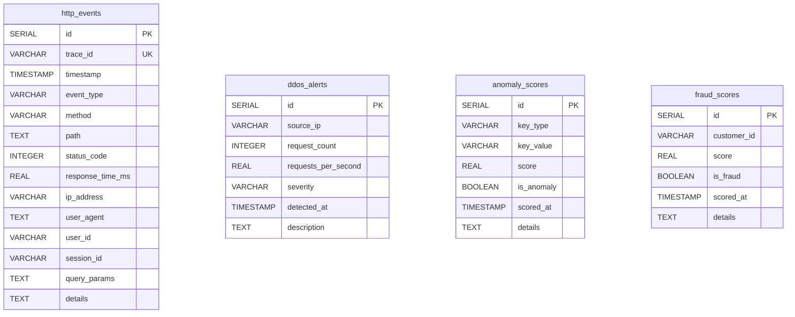
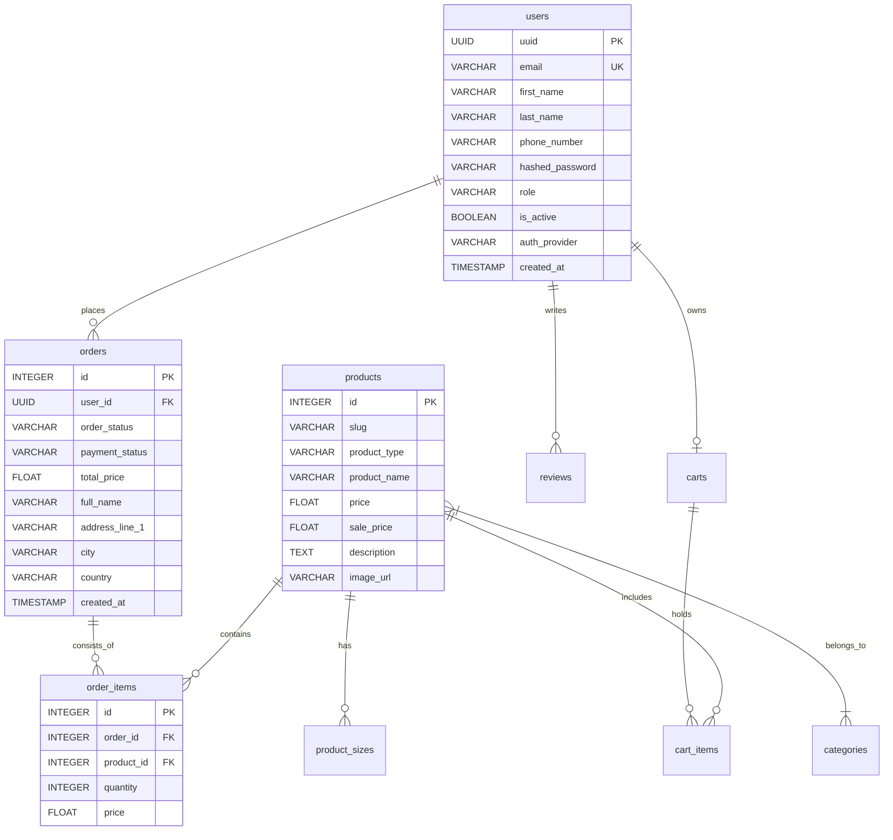

# 🗄️ Database & Event Schema Documentation

This document provides a comprehensive specification of all relational database schemas, SQLite fallbacks, indexes, entity relationships, and JSON telemetry event contracts across the **E-Commerce** and **Cyber Security Dashboard** platform.

---

## 📐 Architecture & Database Distribution

The platform utilizes two distinct, decoupled PostgreSQL databases (with SQLite fallbacks for standalone mode):

1. **`cyber_security` Database**: High-throughput telemetry ingestion, anomaly detection logs, feature aggregation windows, volumetric alert tables, and security scoring metrics.
2. **`e_commerce` Database**: Production e-commerce domain models including users, products, categories, shopping carts, orders, reviews, and pending verification tokens.





---

## 1. 🛡️ Cyber Security Database Schema (`cyber_security`)

PostgreSQL DDL script location: [`cyber_dashboard/backend/db/schema.sql`](file:///c:/Users/Shivam/OneDrive/Documents/Desktop/cyber_security/cyber_dashboard/backend/db/schema.sql)

### 1.1 Table: `http_events`
Stores raw HTTP telemetry logs intercepted from application endpoints for auditing, compliance, and anomaly analysis.

| Column | Data Type | Constraints | Description |
| :--- | :--- | :--- | :--- |
| `id` | `SERIAL` | `PRIMARY KEY` | Auto-incrementing internal surrogate key |
| `trace_id` | `VARCHAR(64)` | `UNIQUE` | Globally unique HTTP request correlation identifier |
| `timestamp` | `TIMESTAMP WITH TIME ZONE` | `NOT NULL` | Exact UTC timestamp of HTTP request execution |
| `event_type` | `VARCHAR(32)` | — | Classification of telemetry topic (e.g., `http-logs`) |
| `method` | `VARCHAR(16)` | — | HTTP Method (`GET`, `POST`, `PUT`, `DELETE`, etc.) |
| `path` | `TEXT` | — | Target URI path (e.g., `/products/slug/test-product`) |
| `status_code` | `INTEGER` | — | HTTP response status code (e.g., `200`, `401`, `404`, `500`) |
| `response_time_ms` | `REAL` | — | Server execution and response duration in milliseconds |
| `ip_address` | `VARCHAR(64)` | `INDEXED` | Originating IPv4 or IPv6 client address |
| `user_agent` | `TEXT` | — | HTTP `User-Agent` client header string |
| `user_id` | `VARCHAR(64)` | — | Authenticated user UUID (if logged in) |
| `session_id` | `VARCHAR(64)` | — | Client web session identifier |
| `query_params` | `TEXT` | — | Raw URL query string parameters |
| `details` | `TEXT` | — | JSON string of additional request metadata / context |

---

### 1.2 Table: `ddos_alerts`
Stores flagged volumetric Distributed Denial-of-Service (DDoS) traffic burst incidents.

| Column | Data Type | Constraints | Description |
| :--- | :--- | :--- | :--- |
| `id` | `SERIAL` | `PRIMARY KEY` | Unique alert surrogate key |
| `source_ip` | `VARCHAR(64)` | `NOT NULL` | Offending client IP address driving the volumetric surge |
| `request_count` | `INTEGER` | `NOT NULL` | Total requests received in the sliding detection window |
| `requests_per_second` | `REAL` | `NOT NULL` | Measured request velocity ($req / sec$) |
| `severity` | `VARCHAR(16)` | `NOT NULL` | Alert level (`LOW`, `MEDIUM`, `HIGH`, `CRITICAL`) |
| `detected_at` | `TIMESTAMP WITH TIME ZONE` | `NOT NULL, INDEXED` | Timestamp of DDoS rule trigger |
| `description` | `TEXT` | — | Explanatory message summarizing the attack burst |

---

### 1.3 Table: `anomaly_scores`
Records anomaly score evaluations and behavioral threat detections.

| Column | Data Type | Constraints | Description |
| :--- | :--- | :--- | :--- |
| `id` | `SERIAL` | `PRIMARY KEY` | Unique score record key |
| `key_type` | `VARCHAR(32)` | `NOT NULL` | Entity key type (`ip`, `user`, `route`) |
| `key_value` | `VARCHAR(128)` | `NOT NULL` | Entity identifier (e.g., IP `192.168.1.1` or path `/login`) |
| `score` | `REAL` | `NOT NULL` | Computed numerical anomaly score or probability |
| `is_anomaly` | `BOOLEAN` | `NOT NULL` | Flag indicating whether the threshold was exceeded |
| `scored_at` | `TIMESTAMP WITH TIME ZONE` | `NOT NULL, INDEXED` | Timestamp of calculation |
| `details` | `TEXT` | — | JSON payload detailing triggering rules or metrics |

---

### 1.4 Table: `anomaly_feature_windows`
Cold storage feature vectors used for time-series aggregation and machine learning training.

| Column | Data Type | Constraints | Description |
| :--- | :--- | :--- | :--- |
| `id` | `SERIAL` | `PRIMARY KEY` | Unique window record ID |
| `key_type` | `VARCHAR(32)` | `NOT NULL` | Subject key category (`ip`, `user_id`) |
| `key_value` | `VARCHAR(128)` | `NOT NULL` | Subject entity value |
| `feature_vector` | `TEXT` | `NOT NULL` | JSON serialized array of engineered numerical features |
| `window_end_ts` | `TIMESTAMP WITH TIME ZONE` | `NOT NULL` | End timestamp of the window period |

---

### 1.5 Table: `fraud_scores`
Output table for checkout transaction risk modeling and payment fraud flags.

| Column | Data Type | Constraints | Description |
| :--- | :--- | :--- | :--- |
| `id` | `SERIAL` | `PRIMARY KEY` | Unique fraud assessment ID |
| `customer_id` | `VARCHAR(128)` | `NOT NULL` | Customer UUID or email identifier |
| `score` | `REAL` | `NOT NULL` | Computed fraud risk score |
| `is_fraud` | `BOOLEAN` | `NOT NULL` | Flag indicating high-risk transaction |
| `scored_at` | `TIMESTAMP WITH TIME ZONE` | `NOT NULL, INDEXED` | Timestamp of evaluation |
| `details` | `TEXT` | — | Context JSON (order ID, risk indicators, velocity) |

---

### 1.6 Table: `fraud_feature_windows`
Aggregated customer behavioral features for checkout fraud detection models.

| Column | Data Type | Constraints | Description |
| :--- | :--- | :--- | :--- |
| `id` | `SERIAL` | `PRIMARY KEY` | Feature window identifier |
| `customer_id` | `VARCHAR(128)` | `NOT NULL` | Customer ID |
| `feature_vector` | `TEXT` | `NOT NULL` | JSON string of transaction features |
| `window_end_ts` | `TIMESTAMP WITH TIME ZONE` | `NOT NULL` | Window expiration timestamp |

---

## 2. 🛒 E-Commerce Database Schema (`e_commerce`)

ORM Models location: [`e_commerce/backend/app/models/`](file:///c:/Users/Shivam/OneDrive/Documents/Desktop/cyber_security/e_commerce/backend/app/models/)

### 2.1 Table: `users`
Core user entity managing customer credentials, roles, and JWT session states.

| Column | Data Type | Constraints | Description |
| :--- | :--- | :--- | :--- |
| `uuid` | `UUID` | `PRIMARY KEY` | Random UUID primary key |
| `first_name` | `VARCHAR` | `NOT NULL` | User's first name |
| `last_name` | `VARCHAR` | `NOT NULL` | User's last name |
| `email` | `VARCHAR` | `UNIQUE, NOT NULL, INDEXED` | Primary email address |
| `phone_number` | `VARCHAR` | `NULLABLE` | Optional contact phone number |
| `hashed_password` | `VARCHAR` | `NOT NULL` | Bcrypt hashed password |
| `role` | `VARCHAR` | `DEFAULT 'customer'` | User permission role (`customer`, `admin`) |
| `is_active` | `BOOLEAN` | `DEFAULT TRUE` | Account status flag |
| `auth_provider` | `VARCHAR` | `DEFAULT 'local'` | Authentication source (`local`, `google`) |
| `refresh_token` | `VARCHAR` | `NULLABLE` | Active JWT refresh token |
| `refresh_token_expiry` | `TIMESTAMP` | `NULLABLE` | Expiration timestamp for refresh token |
| `created_at` | `TIMESTAMP` | `SERVER DEFAULT NOW()` | Account registration timestamp |
| `updated_at` | `TIMESTAMP` | `SERVER DEFAULT NOW()` | Last profile update timestamp |

---

### 2.2 Table: `products`
Product catalog management.

| Column | Data Type | Constraints | Description |
| :--- | :--- | :--- | :--- |
| `id` | `INTEGER` | `PRIMARY KEY` | Product ID |
| `slug` | `VARCHAR` | — | URL-friendly slug (e.g., `cyber-security-hoodie`) |
| `product_type` | `VARCHAR` | `INDEXED` | Category tag / product type |
| `product_name` | `VARCHAR` | — | Display title of product |
| `price` | `FLOAT` | `NOT NULL` | Base retail price |
| `sale_price` | `FLOAT` | `NULLABLE` | Discounted promotional price |
| `blurb` | `TEXT` | `NULLABLE` | Short preview summary |
| `description` | `TEXT` | `NULLABLE` | Detailed product specifications |
| `image_url` | `VARCHAR` | `NULLABLE` | Hosted thumbnail/image URL |

---

### 2.3 Table: `product_sizes`
Stock inventory per product variant/size.

| Column | Data Type | Constraints | Description |
| :--- | :--- | :--- | :--- |
| `id` | `INTEGER` | `PRIMARY KEY` | Size variant ID |
| `product_id` | `INTEGER` | `FOREIGN KEY (products.id)` | Associated product |
| `size` | `VARCHAR` | — | Size label (`S`, `M`, `L`, `XL`, `Universal`) |
| `stock_quantity` | `INTEGER` | `NOT NULL, DEFAULT 0` | Available units in inventory |

---

### 2.4 Table: `categories` & `product_categories`
Product categorization and junction table for many-to-many relationships.

* **`categories`**: `id` (`PK`), `name` (`VARCHAR`), `description` (`TEXT`).
* **`product_categories`**: `product_id` (`FK -> products.id`), `category_id` (`FK -> categories.id`).

---

### 2.5 Table: `carts` & `cart_items`
Shopping cart state management per user.

* **`carts`**:
  * `id` (`INTEGER PRIMARY KEY`)
  * `user_id` (`UUID FOREIGN KEY -> users.uuid`)
  * `created_at` (`TIMESTAMP`)
* **`cart_items`**:
  * `id` (`INTEGER PRIMARY KEY`)
  * `cart_id` (`INTEGER FOREIGN KEY -> carts.id`)
  * `product_id` (`INTEGER FOREIGN KEY -> products.id`)
  * `product_size_id` (`INTEGER FOREIGN KEY -> product_sizes.id`)
  * `quantity` (`INTEGER NOT NULL DEFAULT 1`)
  * `price` (`FLOAT NOT NULL`)

---

### 2.6 Table: `orders` & `order_items`
Order fulfillment records and transaction price snapshots.

* **`orders`**:
  * `id` (`INTEGER PRIMARY KEY`)
  * `user_id` (`UUID FOREIGN KEY -> users.uuid`)
  * `order_status` (`VARCHAR`, default `'pending'`)
  * `payment_status` (`VARCHAR`, default `'pending'`)
  * `payment_method` (`VARCHAR`)
  * `total_price` (`FLOAT NOT NULL`)
  * `full_name`, `phone_number`, `address_line_1`, `address_line_2`, `city`, `state`, `postal_code`, `country` (`Shipping details`)
  * `created_at` (`TIMESTAMP`)
* **`order_items`**:
  * `id` (`INTEGER PRIMARY KEY`)
  * `order_id` (`INTEGER FOREIGN KEY -> orders.id`)
  * `product_id` (`INTEGER FOREIGN KEY -> products.id`)
  * `quantity` (`INTEGER NOT NULL`)
  * `price` (`FLOAT NOT NULL`)

---

### 2.7 Table: `reviews`
Product reviews and customer ratings.

| Column | Data Type | Constraints | Description |
| :--- | :--- | :--- | :--- |
| `id` | `INTEGER` | `PRIMARY KEY` | Review ID |
| `product_id` | `INTEGER` | `FOREIGN KEY (products.id)` | Targeted product |
| `user_id` | `UUID` | `FOREIGN KEY (users.uuid)` | Review author |
| `content` | `TEXT` | `NOT NULL` | Written review body |
| `rating` | `INTEGER` | `NOT NULL` | Numerical rating score ($1 - 5$) |

---

### 2.8 Table: `pending_registrations`
Temporary verification pool for user signup workflow.

| Column | Data Type | Constraints | Description |
| :--- | :--- | :--- | :--- |
| `id` | `UUID` | `PRIMARY KEY` | Pending record UUID |
| `email` | `VARCHAR` | `UNIQUE, NOT NULL` | Target registration email |
| `first_name` | `VARCHAR` | `NOT NULL` | First name |
| `last_name` | `VARCHAR` | `NOT NULL` | Last name |
| `hashed_password` | `VARCHAR` | `NOT NULL` | Encrypted password |
| `verification_token` | `VARCHAR` | `UNIQUE, NOT NULL` | Email verification token |
| `expires_at` | `TIMESTAMP` | `NOT NULL` | Expiration deadline |

---

## 3. ⚡ Telemetry Event Payload JSON Schema

The `http_tracing.py` middleware streams JSON telemetry payloads over Kafka (or TCP sockets) following this JSON schema:

```json
{
  "$schema": "http://json-schema.org/draft-07/schema#",
  "title": "HTTPTelemetryLogEvent",
  "type": "object",
  "required": [
    "trace_id",
    "timestamp",
    "method",
    "path",
    "status_code",
    "response_time_ms",
    "ip_address"
  ],
  "properties": {
    "trace_id": {
      "type": "string",
      "format": "uuid",
      "description": "Unique identifier for request tracing across services"
    },
    "timestamp": {
      "type": "string",
      "format": "date-time",
      "description": "ISO 8601 UTC timestamp when request completed"
    },
    "method": {
      "type": "string",
      "enum": ["GET", "POST", "PUT", "PATCH", "DELETE", "OPTIONS", "HEAD"]
    },
    "path": {
      "type": "string",
      "description": "Clean endpoint path"
    },
    "status_code": {
      "type": "integer",
      "minimum": 100,
      "maximum": 599
    },
    "response_time_ms": {
      "type": "number",
      "minimum": 0.0,
      "description": "Execution duration in milliseconds"
    },
    "ip_address": {
      "type": "string",
      "description": "Client IP address"
    },
    "user_agent": {
      "type": "string",
      "description": "User agent header string"
    },
    "user_id": {
      "type": ["string", "null"],
      "description": "Authenticated user UUID if present"
    },
    "session_id": {
      "type": ["string", "null"],
      "description": "Web session identifier"
    },
    "query_params": {
      "type": "string",
      "description": "URL query parameters"
    },
    "details": {
      "type": "object",
      "description": "Extra contextual key-value metrics"
    }
  }
}
```

---

## 4. 🗃️ Standalone SQLite Schema (`cyber_dashboard.db`)

When running in Standalone Mode (`python cyber_dashboard/backend/main.py`), the backend automatically creates two local SQLite tables:

### Table: `events`
`id` (INTEGER PK), `trace_id` (TEXT), `timestamp` (TEXT), `event_type` (TEXT), `method` (TEXT), `path` (TEXT), `status_code` (INTEGER), `response_time_ms` (REAL), `ip_address` (TEXT), `user_agent` (TEXT), `user_id` (TEXT), `session_id` (TEXT), `query_params` (TEXT), `details` (TEXT).

### Table: `anomalies`
`id` (INTEGER PK), `anomaly_id` (TEXT), `timestamp` (TEXT), `event_id` (TEXT), `event_type` (TEXT), `anomaly_type` (TEXT), `severity` (TEXT), `description` (TEXT), `ip_address` (TEXT), `path` (TEXT), `details` (TEXT).

---

## ⚡ Performance & Database Indexing

To support real-time sub-millisecond dashboard queries and high-concurrency ingestion rates:

1. **`idx_http_events_ip`**: B-Tree index on `http_events(ip_address)` for instant rate-limiting & IP lookup.
2. **`idx_http_events_timestamp`**: Descending B-Tree index on `http_events(timestamp DESC)` for efficient log tailing & dynamic time-series charts.
3. **`idx_ddos_alerts_detected`**: Descending index on `ddos_alerts(detected_at DESC)` for live DDoS dashboard widgets.
4. **`idx_anomaly_scores_scored`**: Descending index on `anomaly_scores(scored_at DESC)` for real-time alert feed updates.
